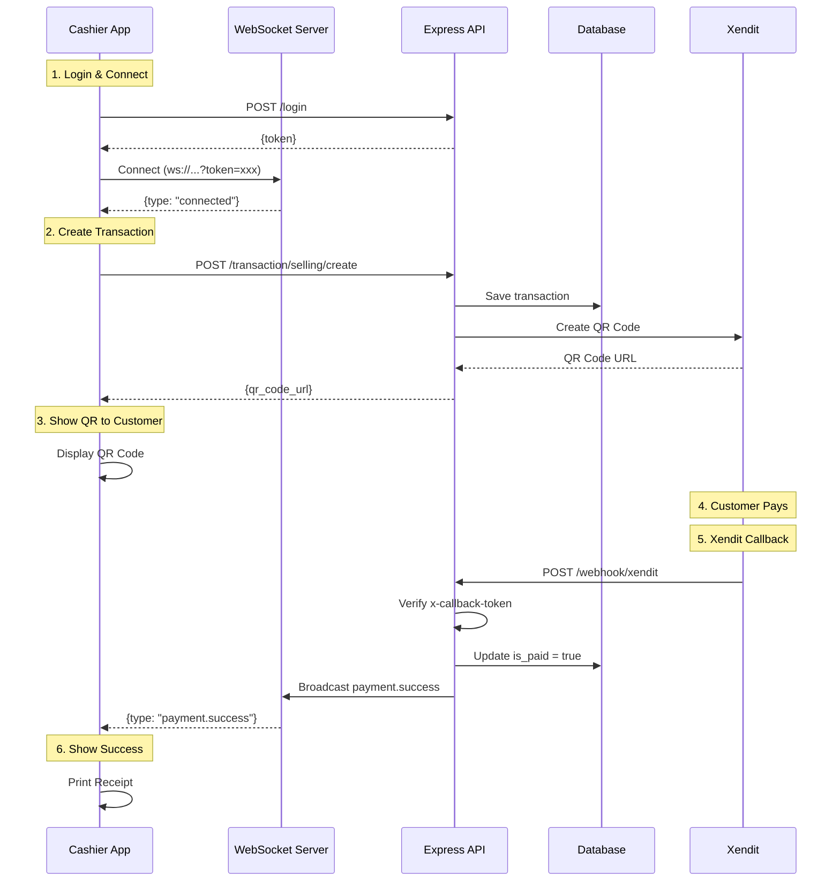

# WebSocket & Webhook Integration

Dokumentasi untuk fitur real-time communication menggunakan WebSocket dan payment notification via Xendit Webhook.

## Table of Contents

- [WebSocket Server](#websocket-server)
- [Xendit Webhook](#xendit-webhook)
- [Integration Flow](#integration-flow)
- [Examples](#examples)

---

## WebSocket Server

WebSocket server untuk komunikasi real-time antara backend dan aplikasi kasir.

### Connection

**Endpoint:** `ws://localhost:3000?token=YOUR_SESSION_TOKEN`

**Authentication:** Required (Session token dari `/login`)

### Connection Flow

```javascript
// Client-side example
const token = "your_session_token_from_login";
const ws = new WebSocket(`ws://localhost:3000?token=${token}`);

ws.onopen = () => {
	console.log("Connected to WebSocket");
};

ws.onmessage = (event) => {
	const message = JSON.parse(event.data);
	console.log("Received:", message);

	// Handle different message types
	switch (message.type) {
		case "connected":
			console.log("Connection confirmed:", message.clientId);
			break;
		case "payment.success":
			console.log("Payment successful:", message.data);
			break;
		case "payment.expired":
			console.log("Payment expired:", message.data);
			break;
	}
};

ws.onerror = (error) => {
	console.error("WebSocket error:", error);
};

ws.onclose = () => {
	console.log("Disconnected from WebSocket");
};
```

### Message Types

#### 1. Connection Confirmation

Dikirim server saat koneksi berhasil.

```json
{
	"type": "connected",
	"clientId": "userId_1234567890"
}
```

#### 2. Payment Success

Dikirim saat pembayaran berhasil (dari Xendit webhook).

```json
{
	"type": "payment.success",
	"data": {
		"reference_id": "transaction_123",
		"amount": 150000,
		"status": "PAID",
		"qr_id": "qr_8182837te-87st-49ing"
	},
	"timestamp": "2024-01-15T10:30:00.000Z"
}
```

#### 3. Payment Expired

Dikirim saat QR code pembayaran expired.

```json
{
	"type": "payment.expired",
	"data": {
		"reference_id": "transaction_123",
		"status": "EXPIRED",
		"qr_id": "qr_8182837te-87st-49ing"
	},
	"timestamp": "2024-01-15T10:35:00.000Z"
}
```

### Authentication

WebSocket menggunakan **session token yang sama dengan API REST**.

**Query Parameter:**

- `token` (required) - Session token dari endpoint `/login`

**Authentication Flow:**

1. User login via `POST /login`
2. Simpan token dari response
3. Connect ke WebSocket dengan token di query string
4. Server verify token menggunakan `middleware/auth.js`
5. Jika valid, koneksi established
6. Jika invalid, koneksi ditutup dengan code `4001`

**Error Codes:**

- `4001` - Token required / Invalid token / Authentication failed

### Client Registry

Server menyimpan informasi client yang terkoneksi:

```javascript
{
  clientId: "userId_timestamp",
  ws: WebSocketConnection,
  userId: "user123",
  marketId: "market01",
  permissions: ["selling", "purchase"]
}
```

### Broadcasting

Server dapat broadcast message ke:

- **Semua client** - Tanpa filter
- **Specific market** - Filter by `marketId`
- **Specific user** - Filter by `userId`

---

## Xendit Webhook

Endpoint untuk menerima notifikasi pembayaran dari Xendit.

### Endpoint

**URL:** `POST /webhook/xendit`

**Authentication:** Callback token verification (header `x-callback-token`)

**Public Access:** Yes (no Bearer token required)

### Configuration

Set environment variable di `.env`:

```env
XENDIT_WEBHOOK_TOKEN=your_xendit_callback_token
```

**Cara mendapatkan token:**

1. Login ke Xendit Dashboard
2. Settings → Webhooks
3. Copy Verification Token
4. Paste ke `.env`

### Request Headers

```
Content-Type: application/json
x-callback-token: your_xendit_callback_token
```

### Supported Events

#### 1. QR Payment Success

**Event:** `qr.payment`

**Request Body:**

```json
{
	"event": "qr.payment",
	"created": "2024-01-15T10:30:00.000Z",
	"business_id": "62dd802cc1a7bb74407bfce9",
	"data": {
		"id": "qrpy_8182837te-87st-49ing-8696-1239bd4d759c",
		"business_id": "62dd802cc1a7bb74407bfce9",
		"currency": "IDR",
		"amount": 150000,
		"status": "SUCCEEDED",
		"created": "2024-01-15T10:30:00.000Z",
		"qr_id": "qr_8182837te-87st-49ing-8696-1239bd4d759c",
		"reference_id": "transaction_123",
		"type": "DYNAMIC",
		"channel_code": "ID_DANA",
		"payment_detail": {
			"receipt_id": "000111666",
			"source": "GOPAY"
		}
	}
}
```

**Response:**

```json
{
	"received": true
}
```

**Actions:**

1. Verify `x-callback-token` header
2. Update transaction `is_paid` to `true` in database
3. Broadcast `payment.success` to WebSocket clients

#### 2. Payment Expired

**Event:** `payment.expired` or `qr.expired`

**Request Body:**

```json
{
	"event": "qr.expired",
	"data": {
		"reference_id": "transaction_123",
		"qr_id": "qr_8182837te-87st-49ing"
	}
}
```

**Response:**

```json
{
	"received": true
}
```

**Actions:**

1. Verify `x-callback-token` header
2. Broadcast `payment.expired` to WebSocket clients

### Error Responses

**401 Unauthorized** - Invalid callback token

```json
{
	"message": "Unauthorized"
}
```

**500 Server Error** - Missing configuration

```json
{
	"message": "Server configuration error"
}
```

### Testing Webhook

#### Using curl

```bash
curl -X POST http://localhost:3000/webhook/xendit \
  -H "Content-Type: application/json" \
  -H "x-callback-token: YOUR_XENDIT_WEBHOOK_TOKEN" \
  -d '{
    "event": "qr.payment",
    "data": {
      "reference_id": "testing_id_123",
      "amount": 150000,
      "status": "SUCCEEDED",
      "qr_id": "qr_test_123"
    }
  }'
```

#### Using Postman

1. Method: `POST`
2. URL: `http://localhost:3000/webhook/xendit`
3. Headers:
   - `Content-Type: application/json`
   - `x-callback-token: YOUR_XENDIT_WEBHOOK_TOKEN`
4. Body (raw JSON):
   ```json
   {
   	"event": "qr.payment",
   	"data": {
   		"reference_id": "your_transaction_id",
   		"amount": 150000,
   		"status": "SUCCEEDED"
   	}
   }
   ```

#### Using ngrok for Testing

Untuk test dengan Xendit real callback:

```bash
# 1. Start ngrok
ngrok http 3000

# 2. Copy HTTPS URL (e.g., https://abc123.ngrok.io)

# 3. Set di Xendit Dashboard:
#    Settings → Webhooks → Add Webhook URL
#    URL: https://abc123.ngrok.io/webhook/xendit

# 4. Test payment dengan Xendit
```

---

## Integration Flow

### Complete Payment Flow



### Code Example: Complete Integration

```javascript
// 1. Login
const loginResponse = await fetch("http://localhost:3000/login", {
	method: "POST",
	headers: { "Content-Type": "application/json" },
	body: JSON.stringify({
		username: "kasir01",
		password: "password123",
	}),
});
const { token } = await loginResponse.json();

// 2. Connect WebSocket
const ws = new WebSocket(`ws://localhost:3000?token=${token}`);

ws.onmessage = (event) => {
	const message = JSON.parse(event.data);

	if (message.type === "payment.success") {
		console.log("Payment received!");
		console.log("Transaction:", message.data.reference_id);
		console.log("Amount:", message.data.amount);

		// Update UI
		showPaymentSuccess(message.data);

		// Print receipt
		printReceipt(message.data.reference_id);
	}

	if (message.type === "payment.expired") {
		console.log("Payment expired");
		showPaymentExpired();
	}
};

// 3. Create Transaction
const createTransaction = async (items) => {
	const response = await fetch(
		"http://localhost:3000/transaction/selling/create",
		{
			method: "POST",
			headers: {
				Authorization: `Bearer ${token}`,
				"Content-Type": "application/x-www-form-urlencoded",
			},
			body: new URLSearchParams({
				total_price: 150000,
				payed_money: 150000,
				change_money: 0,
				is_paid: "2", // unpaid
				payment_method_id: "qris_payment",
				market_id: "market01",
				user_id: "user123",
				items: JSON.stringify(items),
			}),
		},
	);

	return await response.json();
};

// 4. Wait for payment via WebSocket
// Payment notification akan datang otomatis via ws.onmessage
```

---

## Security

### WebSocket Security

- ✅ **Authentication Required** - Semua koneksi harus authenticated
- ✅ **Session Validation** - Token divalidasi via database session
- ✅ **Auto Disconnect** - Invalid token langsung disconnect
- ✅ **Same Auth as API** - Menggunakan `middleware/auth.js` yang sama

### Webhook Security

- ✅ **Token Verification** - Verify `x-callback-token` header
- ✅ **HTTPS Only (Production)** - Gunakan HTTPS untuk production
- ✅ **IP Whitelist (Optional)** - Bisa tambahkan IP whitelist Xendit
- ✅ **Idempotency** - Webhook bisa dipanggil multiple times (safe)

---

## Troubleshooting

### WebSocket Connection Failed

**Problem:** `WebSocket connection failed`

**Solutions:**

1. Check token validity: `GET /user/session/byid/:token`
2. Ensure server is running
3. Check firewall/proxy settings
4. Verify WebSocket URL format: `ws://host?token=xxx`

### Webhook Not Receiving

**Problem:** Xendit webhook tidak sampai

**Solutions:**

1. Check `XENDIT_WEBHOOK_TOKEN` di `.env`
2. Verify webhook URL di Xendit Dashboard
3. Check server logs: `Webhook: Invalid callback token`
4. Test dengan curl/Postman dulu
5. Ensure ngrok is running (for local testing)

### Payment Not Broadcasting

**Problem:** Webhook received tapi WebSocket tidak broadcast

**Solutions:**

1. Check WebSocket clients connected: `websocket.getClientCount()`
2. Verify `reference_id` matches transaction `id` in database
3. Check server logs untuk error
4. Ensure WebSocket connection masih active

---

## Best Practices

### WebSocket

1. **Reconnection Logic**

   ```javascript
   function connectWebSocket() {
   	const ws = new WebSocket(`ws://localhost:3000?token=${token}`);

   	ws.onclose = () => {
   		console.log("Reconnecting in 3s...");
   		setTimeout(connectWebSocket, 3000);
   	};

   	return ws;
   }
   ```

2. **Heartbeat/Ping**

   ```javascript
   setInterval(() => {
   	if (ws.readyState === WebSocket.OPEN) {
   		ws.send(JSON.stringify({ type: "ping" }));
   	}
   }, 30000); // every 30s
   ```

3. **Cleanup on Unmount**
   ```javascript
   // React example
   useEffect(() => {
   	const ws = connectWebSocket();
   	return () => ws.close();
   }, []);
   ```

### Webhook

1. **Always Return 200**
   - Xendit akan retry jika response bukan 200
   - Return 200 even if ada error internal

2. **Idempotent Handling**
   - Check if payment sudah diproses
   - Prevent double processing

3. **Async Processing**
   - Process webhook async jika heavy operation
   - Return 200 immediately

---

## Monitoring

### WebSocket Metrics

```javascript
// Get connected clients count
const clientCount = websocket.getClientCount();
console.log(`Connected clients: ${clientCount}`);
```

### Webhook Logs

Server logs semua webhook events:

```
Webhook: Received Xendit event: qr.payment
Webhook: Payment success for transaction_123
Webhook: Updated transaction transaction_123 to paid
```

---

## References

- [WebSocket API (MDN)](https://developer.mozilla.org/en-US/docs/Web/API/WebSocket)
- [Xendit Webhook Documentation](https://developers.xendit.co/api-reference/#webhooks)
- [Xendit QR Codes](https://developers.xendit.co/api-reference/#qr-codes)
